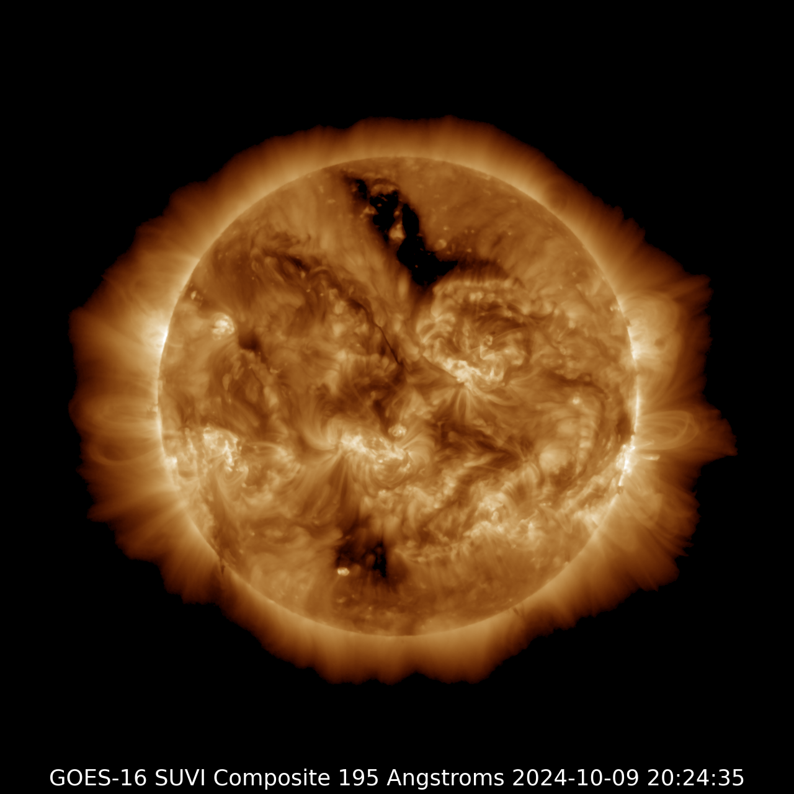
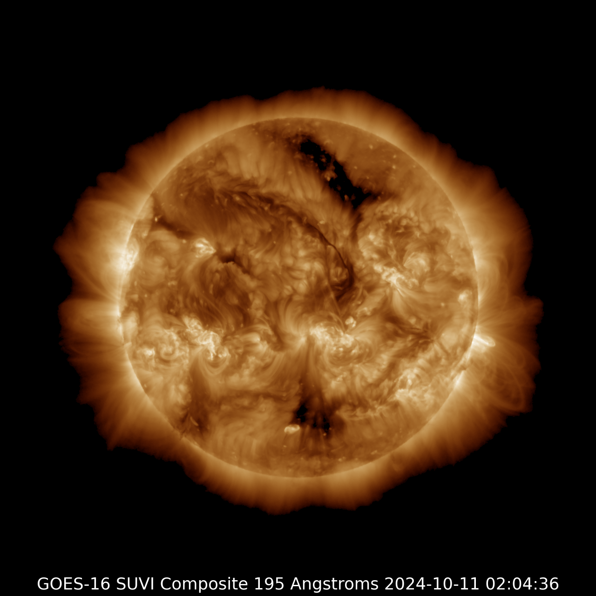

# Exposing the Unseen Layers of the Sun during Solar Disruptions of Oct-2024

- Dare to Dream
- Inspire Bold Leadership
- Embrace Diversity in Thought and Innovation
- Explore & Unveil the Depths of Interplanetary Knowledge

----------------------

This idea introduces an unconventional method for segmenting solar images using advanced techniques to isolate critical features like sunspots and solar flares. By effectively slicing images into meaningful segments, the approach enhances the analysis and interpretation of solar data, improving predictive models of solar activity.

The method not only deepens our understanding of solar phenomena but also holds promise for advancing space weather forecasting and the broader study of astrophysical processes.

_Note: The code was executed on my personal MacBook Pro (Retina, Mid 2012)._

-----------------------

## Exposing the Unseen Layers of the Sun during Solar Disruptions October 2024

### GOES-16SUVI-2024-10-09-20-24-35

_source: https://www.swpc.noaa.gov/_

---------------

_Note: The images below were spliced on my personal MacBook Pro (Retina, Mid 2012)._

### GOES-16SUVI-2024-10-11-02-04-36

_source: https://www.swpc.noaa.gov/_

---------------

_Note: The images below were spliced on my personal MacBook Pro (Retina, Mid 2012)._

### GOES-16SUVI-2024-10-13-16-48-38

_source: https://www.swpc.noaa.gov/_

---------------

_Note: The images below were spliced on my personal MacBook Pro (Retina, Mid 2012)._

---------------

_Additional Splices: https://github.com/ubc-tuehoang/Exposing-the-Unseen-Layers-of-the-Sun-during-Solar-Disruptions/tree/main/splices_
